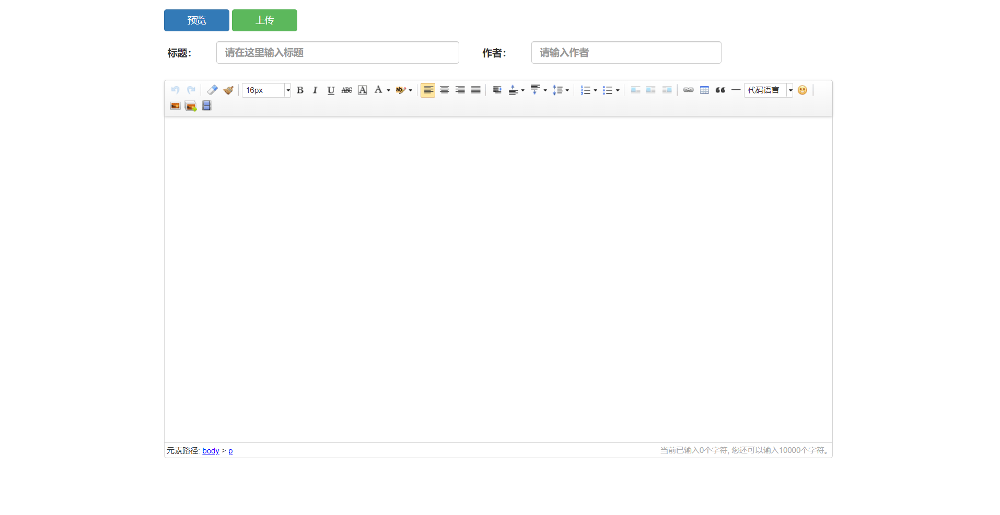
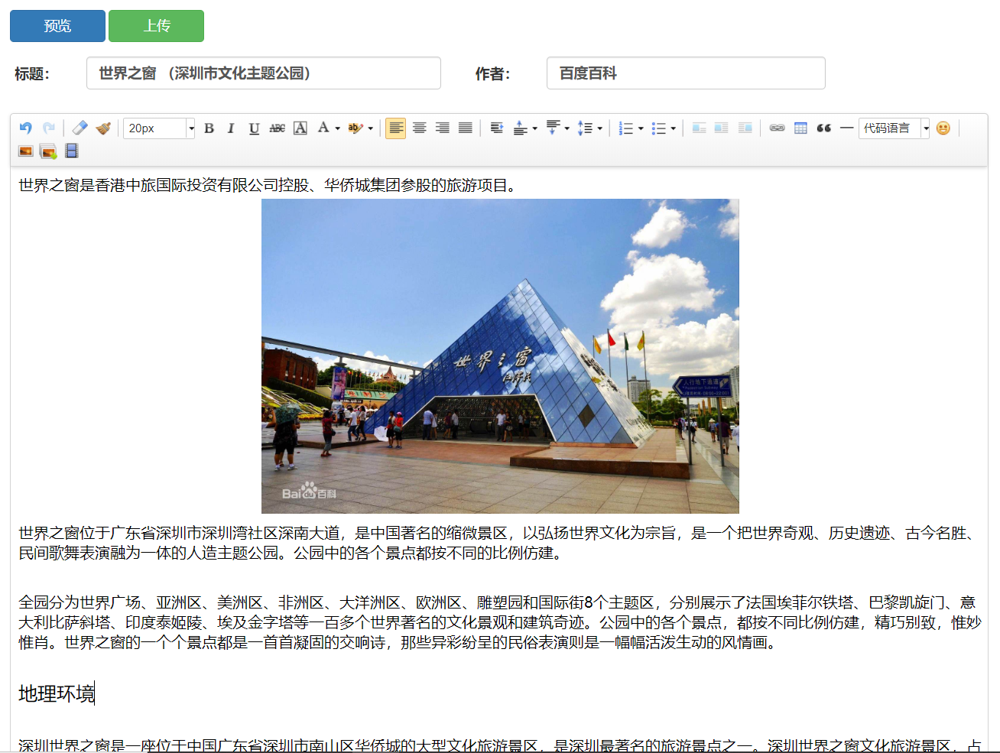
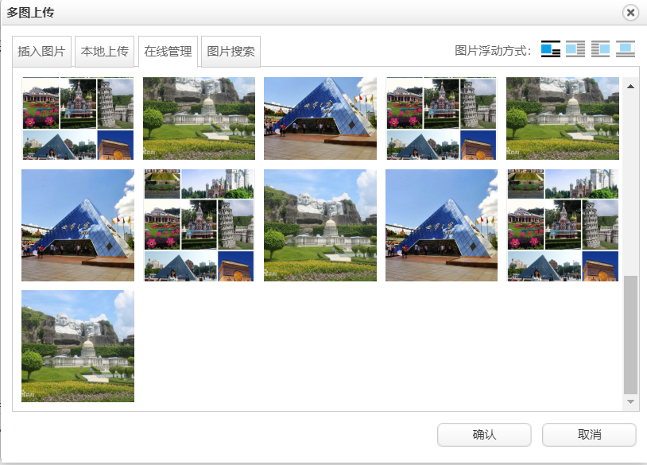
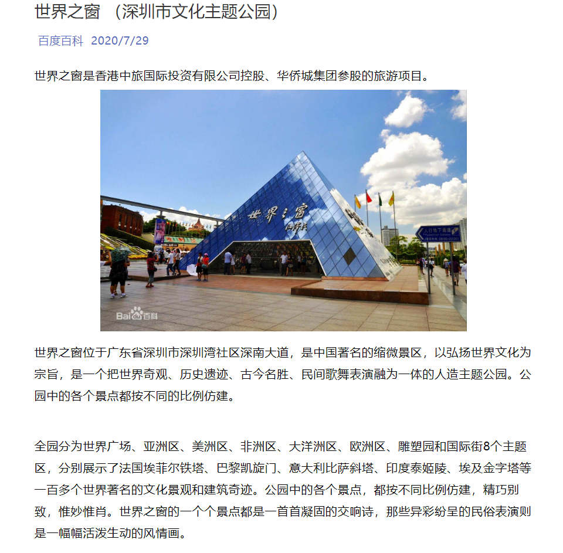

## UEditor富文本编辑器定制

### 功能与效果

#### 效果图：



#### 版本

JSP 版本

#### 功能：

- **单图上传**
- **多图上传**
- **上传视频**
- **结果导出为自适应样式的html**

- **预览功能**

### 本地测试

#### 下载使用

下载后将apache-tomcat-8.5.56-windows-x64放在你想放的位置

双击运行 /apache-tomcat-8.5.56-windows-x64\bin\startup.bat启动Tomcat

#### 测试地址

```
http://localhost:8080/ueditor1_4_3_3-utf8-jsp/utf8-jsp/index.html
```

#### 放在自己的服务器

提取ueditor1_4_3_3-utf8-jsp文件放在Tomcat webapps下

### 文件上传位置

```
\apache-tomcat-8.5.56-windows-x64\webapps\ueditor1_4_3_3-utf8-jsp\ueditor\jsp\upload\
```

### 其他说明

**页面上传按钮功能未实现。**

仓库内容包括：

- 整个Tomcat程序

UEditor位置：

- **\webapps\ueditor1_4_3_3-utf8-jsp**

### 使用截图

#### 编辑中



#### 多图上传页面



#### 预览页面



### Github仓库地址

[Github](https://github.com/zuahua/customUEditor)

### 参考

[UEditor官方文档](http://fex.baidu.com/ueditor/#api-common)
